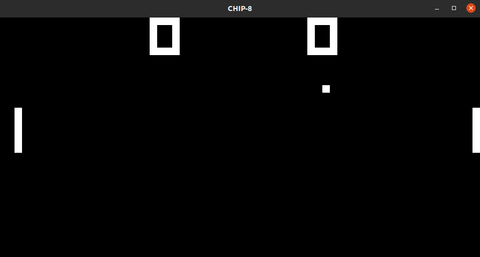

# chip8-cpp



A CHIP 8 emulator in C++

No sound support


## Requirements
- SDL 2

## ROMs Tested
- IBM Logo
- PONG 
- TETRIS

## To Run
- `cd chip8`
- ```g++ main.cc `pkg-config --cflags --libs sdl2` -o CHIP8```
- `./CHIP8 <ROM_PATH> <FPS>`

## Keypad

<table>
  <tr>
      <td>1</td>
      <td>2</td>
      <td>3</td>
      <td>4</td>
  </tr>
   <tr>
      <td>Q</td>
      <td>W</td>
      <td>E</td>
      <td>R</td>
  </tr>
  <tr>
      <td>A</td>
      <td>S</td>
      <td>D</td>
      <td>F</td>
  </tr>
  <tr>
      <td>Z</td>
      <td>X</td>
      <td>C</td>
      <td>V</td>
  </tr>
</table>


## References / Help
- https://tobiasvl.github.io/blog/write-a-chip-8-emulator/
- https://austinmorlan.com/posts/chip8_emulator/
- https://github.com/JamesGriffin/CHIP-8-Emulator/
- The Emulation Development discord helped me fix some nasty bugs :)
